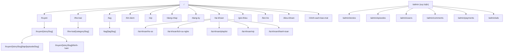
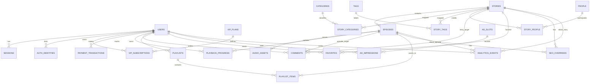

# Kế hoạch Markdown cho Codex xây dựng website tương tự truyenaudio25.com

## Tóm tắt điều hành

**Phạm vi nguồn duy nhất của tài liệu này là `truyenaudio25.com`.** Tại thời điểm nghiên cứu ngày 2026-05-15, việc truy xuất trực tiếp tới các biến thể root URL của domain này đều thất bại, nên **không thể xác minh live-site**, không thể thu thập sitemap thực tế, không thể kiểm chứng các route nội bộ, và cũng không thể lấy ảnh chụp màn hình từ nguồn gốc. Vì vậy, toàn bộ phần dưới đây được viết theo nguyên tắc **“evidence-first, assumption-labeled”**: mọi điểm nào không quan sát được từ site đều được đánh dấu là **giả định/suy luận triển khai**. citeturn1view0turn2view0turn2view1turn2view2

Với điều kiện đó, hướng triển khai an toàn nhất cho Codex là coi đây là một **nền tảng truyện audio** có các trục chức năng chính: duyệt nội dung, chi tiết truyện, danh sách tập, trình phát audio, tài khoản người dùng, lịch sử nghe, VIP/thanh toán, bình luận, SEO, analytics, quảng cáo và khả năng mở rộng. Đây là **bản kế hoạch thực thi** hơn là bản “reverse-engineering đã xác minh” của website gốc.

Khuyến nghị thực hành cho Codex là:  
(1) dựng hệ thống theo kiến trúc mô-đun để dễ chỉnh lại khi source truy cập được;  
(2) đặt toàn bộ route, nhãn UI, entitlement VIP, ad slots và hành vi player vào lớp cấu hình;  
(3) gắn cờ `TODO[SOURCE-VALIDATE]` tại mọi chỗ phụ thuộc bố cục, copywriting hoặc luồng chưa xác minh;  
(4) ưu tiên hoàn thiện **browse → detail → player → auth → VIP → comments** trước, rồi mới tới playlist, ads nâng cao và tối ưu hậu kỳ.

## Phạm vi nguồn và giới hạn bằng chứng

Bảng dưới đây xác định rõ ràng ràng buộc nguồn và mức độ tin cậy của tài liệu.

| Mục | Giá trị |
|---|---|
| Nguồn cho phép duy nhất | `truyenaudio25.com` |
| Thời điểm snapshot | `2026-05-15` theo múi giờ `Asia/Ho_Chi_Minh` |
| Loại bằng chứng trực tiếp có được | **Chỉ có bằng chứng rằng root URL không truy xuất được** |
| Loại bằng chứng không có | Nội dung HTML thực tế, route nội bộ, metadata SEO, ảnh, component UI, player behavior, account flow, payment flow |
| Hệ quả | Mọi cấu trúc trang, API, schema và kiến trúc bên dưới là **suy luận triển khai** để Codex có thể bắt đầu build |
| Quy ước nhãn | **Quan sát trực tiếp** = có bằng chứng từ source; **Suy luận** = thiết kế đề xuất; **Chưa xác định** = cần xác nhận lại khi source hoạt động |

Các URL trực tiếp đã thử truy xuất trong phạm vi nguồn cho phép:

```text
https://truyenaudio25.com/
http://truyenaudio25.com/
https://www.truyenaudio25.com/
http://www.truyenaudio25.com/
```

Các lần truy xuất trên đều thất bại trong phiên nghiên cứu, nên báo cáo này **không tuyên bố** rằng những route, thành phần hoặc ảnh bên dưới đang tồn tại thực tế trên live-site; chúng chỉ là đặc tả triển khai hợp lý để Codex làm việc có hệ thống cho đến khi nguồn có thể kiểm chứng lại. citeturn1view0turn2view0turn2view1turn2view2

## Cấu trúc site và UX cần tái tạo

Vì live-site không truy xuất được, sơ đồ và bảng dưới đây là **sitemap suy luận** cho một website truyện audio có player, tài khoản và VIP. Tên route chính xác, pattern slug, cũng như mức sâu phân cấp đều là **giả định cần xác minh lại** khi `truyenaudio25.com` truy cập được. citeturn1view0turn2view0turn2view1turn2view2



### Bảng route phân cấp suy luận

| Path | Mục đích | Mức độ | Bằng chứng / ghi chú |
|---|---|---:|---|
| `/` | Trang chủ, điểm vào browse chính | Cao | `https://truyenaudio25.com/` là URL root duy nhất có thể xác định; nội dung không truy xuất được |
| `/truyen` | Danh sách tất cả truyện / browse catalog | Trung bình | **Suy luận** theo mô hình site truyện audio |
| `/truyen/[storySlug]` | Chi tiết truyện, mô tả, danh sách tập, metadata | Cao | **Suy luận** cần có để hỗ trợ SEO và player |
| `/truyen/[storySlug]/tap/[episodeSlug]` | Trang nghe tập / player page | Cao | **Suy luận** từ yêu cầu player và resume |
| `/the-loai` | Hub liệt kê thể loại | Trung bình | **Suy luận** từ yêu cầu categories |
| `/the-loai/[categorySlug]` | Listing theo thể loại | Cao | **Suy luận** từ browse/filter |
| `/tag` | Hub liệt kê tag | Thấp | **Suy luận**; có thể bỏ ở v1 nếu tag chỉ có landing động |
| `/tag/[tagSlug]` | Listing theo tag | Trung bình | **Suy luận** từ yêu cầu tags và SEO |
| `/tim-kiem` | Kết quả tìm kiếm | Cao | **Suy luận** từ yêu cầu search |
| `/dang-nhap` | Đăng nhập | Cao | **Suy luận** từ yêu cầu user account |
| `/dang-ky` | Đăng ký | Cao | **Suy luận** từ yêu cầu user account |
| `/quen-mat-khau` | Khôi phục mật khẩu | Trung bình | **Suy luận**; chưa xác định có trên source không |
| `/vip` | Landing VIP / lợi ích / gói | Cao | **Suy luận** từ yêu cầu VIP |
| `/tai-khoan` | Dashboard người dùng | Cao | **Suy luận** từ hồ sơ và lịch sử |
| `/tai-khoan/ho-so` | Cập nhật hồ sơ | Trung bình | **Suy luận** |
| `/tai-khoan/lich-su-nghe` | Đồng bộ progress / resume | Cao | **Suy luận** từ yêu cầu player resume |
| `/tai-khoan/playlist` | Playlist cá nhân | Thấp | **Không quan sát được**; để v1.1 hoặc feature flag |
| `/tai-khoan/vip` | Trạng thái VIP / quyền lợi | Trung bình | **Suy luận** |
| `/tai-khoan/thanh-toan` | Lịch sử giao dịch / hóa đơn | Trung bình | **Suy luận** |
| `/gioi-thieu` | Giới thiệu website | Thấp | **Suy luận** |
| `/lien-he` | Form liên hệ / support | Thấp | **Suy luận** |
| `/dieu-khoan` | Terms of service | Trung bình | **Suy luận** bắt buộc nếu có tài khoản / thanh toán |
| `/chinh-sach-bao-mat` | Privacy policy | Trung bình | **Suy luận** bắt buộc nếu có analytics / auth |
| `/admin/*` | CMS / moderation / cấu hình | Trung bình | **Suy luận** cần thiết về mặt triển khai, không phải route public đã xác minh |

### Ảnh chụp và wireframe thay thế

Không thể lấy screenshot hay embed ảnh từ live-site trong phiên nghiên cứu vì source không truy xuất được. Do đó, phần dưới đây dùng **wireframe chú thích** thay cho ảnh chụp. citeturn1view0turn2view0turn2view1turn2view2

**Wireframe desktop đề xuất cho trang chủ**

```text
┌─────────────────────────────────────────────────────────────────────┐
│ Header: Logo | Nav | Thể loại | Tag | Tìm kiếm | VIP | Đăng nhập   │
├─────────────────────────────────────────────────────────────────────┤
│ Hero / Featured stories / Banner VIP or promo                      │
├─────────────────────────────────────────────────────────────────────┤
│ Filter chips: Thể loại | Mới cập nhật | Xem nhiều | Đang hot       │
├─────────────────────────────────────────────────────────────────────┤
│ Shelf 1: Card truyện (cover, title, tags, trạng thái, CTA nghe)    │
├─────────────────────────────────────────────────────────────────────┤
│ Shelf 2: Truyện VIP / Đề cử / Mới cập nhật                         │
├─────────────────────────────────────────────────────────────────────┤
│ Shelf 3: Thể loại nổi bật                                           │
├─────────────────────────────────────────────────────────────────────┤
│ Sticky mini-player bottom                                           │
├─────────────────────────────────────────────────────────────────────┤
│ Footer: chính sách | liên hệ | social | app links                  │
└─────────────────────────────────────────────────────────────────────┘
```

**Wireframe mobile đề xuất cho trang nghe tập**

```text
┌───────────────────────────────┐
│ App bar: Back | Title | More  │
├───────────────────────────────┤
│ Cover art / thumbnail         │
├───────────────────────────────┤
│ Tên truyện                    │
│ Tên tập                       │
├───────────────────────────────┤
│ Progress bar + timecodes      │
├───────────────────────────────┤
│ -15s | Play/Pause | +30s      │
│ Speed | Queue | Sleep timer   │
├───────────────────────────────┤
│ CTA: VIP / No ads (nếu khóa)  │
├───────────────────────────────┤
│ Tab/Accordion: DS tập | MT    │
│ Bình luận | Truyện liên quan  │
└───────────────────────────────┘
```

### Bảng UI/UX theo loại trang

| Loại trang | Khối bố cục chính | Component cần có | Hành vi responsive | Tương tác chính | Ghi chú accessibility | Trạng thái bằng chứng |
|---|---|---|---|---|---|---|
| Trang chủ | Header, hero, các shelf nội dung, footer, mini-player | Logo, menu, search bar, card list, CTA VIP, mini-player | Desktop nhiều cột; mobile 1 cột + menu thu gọn + sticky player | Hover card, click CTA, quick play, mở search | Landmark rõ ràng, heading hierarchy, focus ring, skip link | **Suy luận** |
| Listing thể loại/tag | Header, breadcrumb, filter bar, grid/list cards, phân trang | Filter chips, sort, pagination/load more, cards | Grid 4–6 cột desktop, 2 cột tablet, 1–2 cột mobile | Lọc, sắp xếp, mở card | ARIA cho filter, announce kết quả, thứ tự tab hợp lý | **Suy luận** |
| Chi tiết truyện | Hero meta, mô tả, tags, danh sách tập, bình luận, related | Cover, story meta, badges, episode list, comment thread | Desktop 2 cột; mobile stack dọc; episode list collapsible | Chọn tập, expand mô tả, follow/favorite | Alt text cho cover, semantic list cho tập, accessible accordions | **Suy luận** |
| Trang nghe tập | Player shell, metadata, queue/episode list, related, comments | Timeline, controls, speed control, queue, sleep timer, transcript placeholder | Mobile ưu tiên controls nổi; desktop có queue/sidebar | Play/pause, seek, đổi tốc độ, lưu progress, next/prev | Button labels, keyboard shortcuts, time announcements, contrast tốt | **Suy luận** |
| Tìm kiếm | Search input, suggestion, result blocks | Debounced input, autosuggest, tabs All/Stories/Episodes/Tags | Mobile full-width input và list đơn | Typeahead, enter search, clear, filter | Live region cho result count, accessible combobox | **Suy luận** |
| Đăng nhập/đăng ký | Form-focused layout | Email/password fields, social login optional, errors, reset password | Mobile one-column; desktop centered card | Submit, show/hide password, inline validation | Label rõ ràng, error association, password manager compatible | **Suy luận** |
| Tài khoản/VIP | Sidebar tabs hoặc top tabs, nội dung chính | Profile form, subscription card, payment history, history list | Mobile dùng tabs/accordion | Update profile, manage VIP, xem progress | Form semantics, table/list accessible | **Suy luận** |
| Playlist/Thư viện | List view, reorder, remove actions | Playlist card, item list, drag handle optional | Mobile ưu tiên actions dạng sheet | Tạo playlist, thêm/bớt tập, phát toàn playlist | Reorder accessible alternatives, clear action labels | **Không quan sát được; đề xuất optional** |
| Trang tĩnh | Nội dung văn bản, form liên hệ nếu có | Rich content block, CTA, breadcrumbs | Responsive văn bản đơn cột | Submit form, đọc chính sách | Typography readable, headings and link semantics | **Suy luận** |

## Yêu cầu tính năng và tiêu chí chấp nhận

**Lưu ý:** tất cả tính năng dưới đây là **đặc tả triển khai** để tái tạo một website cùng loại, **không phải khẳng định đã được quan sát trực tiếp trên `truyenaudio25.com`**. Phần “Bằng chứng” vì vậy sẽ được đánh dấu là **Suy luận** hoặc **Chưa xác định** theo đúng giới hạn nguồn đã nêu. citeturn1view0turn2view0turn2view1turn2view2

| Tính năng | Yêu cầu chức năng | Tiêu chí chấp nhận | Edge cases | Bằng chứng |
|---|---|---|---|---|
| Tìm kiếm | Tìm theo tên truyện, slug, tác giả/người đọc nếu có, tag, thể loại; hỗ trợ không dấu | Trả kết quả đúng với query; có empty state; có phân trang; query được share qua URL | Query rỗng; query quá ngắn; tiếng Việt có dấu/không dấu; typo; tên trùng | **Suy luận** |
| Audio player | Play/pause, seek, volume, mute, tốc độ 0.75x–2x, next/prev, queue, resume | Reload vẫn nhớ progress; user đăng nhập thì sync liên thiết bị; player không reset khi chuyển trang mềm | Mạng chập chờn; audio 404; đổi tập khi progress chưa flush; mobile background restrictions | **Suy luận** |
| Resume progress | Lưu tiến độ theo user hoặc local guest state | Quay lại đúng timestamp gần nhất; ghi định kỳ và khi rời trang | Guest sang logged-in merge state; seek liên tục; 2 tab cùng mở | **Suy luận** |
| Queue | Xếp hàng tập đang phát và kế tiếp | Có danh sách queue; reorder hoặc clear; auto-next khi hết tập | Item bị xóa; tập VIP trong queue của user hết hạn VIP | **Suy luận** |
| User account | Đăng ký, đăng nhập, logout, reset password, profile | Auth thành công; lỗi rõ ràng; session bền; profile sửa được | Email trùng; brute-force; session hết hạn; email chưa verify nếu bật | **Suy luận** |
| VIP | Plan, checkout, activate entitlement, hiển thị trạng thái VIP | User VIP thấy badge/trạng thái; ad suppression; unlock nội dung Premium nếu có | Webhook trễ/duplicate; hết hạn giữa lúc đang nghe; refund/cancel | **Suy luận** |
| Comments | Tạo/sửa/xóa comment của mình; moderation; reply một cấp hoặc phẳng | Comment hiển thị đúng thứ tự; anti-spam; pagination | Flood/spam; XSS; deleted user; comment gắn story hay episode | **Suy luận** |
| Categories | Browse theo thể loại; landing page SEO | Tất cả story gắn category hiện đúng; canonical URL | Story thuộc nhiều categories; category rỗng | **Suy luận** |
| Tags | Browse theo tag linh hoạt | Tag pages render tốt; click từ story detail đi được | Tag trùng nghĩa; số tag quá nhiều | **Suy luận** |
| Playlists | Tạo playlist cá nhân, thêm/xóa tập, play all | Playlist lưu per-user; thứ tự item ổn định; share link là optional | Deleted episode; duplicate item; guest playlist local-only | **Không quan sát được; đề xuất v1.1** |
| Ads | Banner/display slot; có thể chèn trước/sau section; VIP ad-free | Non-VIP thấy ad slots; VIP không thấy ad; analytics có impression/click | Ad block; creative lỗi; ad quá nặng làm giảm UX | **Suy luận** |
| Analytics | Pageview, search query, play start, quartiles, complete, VIP conversion | Event không chặn UX; có consent/policy tùy pháp lý; dashboard backend có thể đọc | Trùng sự kiện; offline/retry; privacy boundary | **Suy luận** |
| SEO | Metadata động, canonical, OpenGraph, sitemap, robots, JSON-LD | Trang list/detail có SSR/ISR; heading logic; URL sạch | Duplicate content giữa pages; query indexation; pagination SEO | **Suy luận** |
| Accessibility | WCAG 2.2 AA ở mức thực dụng | Keyboard full-flow; contrast đủ; form errors accessible; player usable với screen reader | Focus trap ở modal; custom slider khó truy cập; autoplay bị chặn | **Suy luận** |

### Thuộc tính cần suy luận hoặc gắn cờ `TODO[SOURCE-VALIDATE]`

Các mục sau đây **chưa xác định** từ source và cần để mở ở tầng cấu hình:

| Thuộc tính | Trạng thái | Gợi ý triển khai |
|---|---|---|
| Naming route chính xác | Chưa xác định | Tập trung toàn bộ ở `routes.ts` |
| Có playlist hay không | Chưa xác định | Feature flag `playlistEnabled` |
| VIP chỉ no-ads hay còn unlock content | Chưa xác định | Mô hình entitlement tách rời `ad_free` và `premium_content` |
| Bình luận gắn story, episode, hay cả hai | Chưa xác định | Hỗ trợ polymorphic target/nullable foreign keys |
| Có người đọc/narrator riêng hay không | Chưa xác định | Tách entity `people` + `story_people` |
| Có download audio hay không | Chưa xác định | Mặc định **không** cho guest; signed URL cho VIP nếu sau này cần |
| Có paywall theo tập hay theo truyện | Chưa xác định | Hỗ trợ cả `story_requires_vip` và `episode_requires_vip` |
| Mô hình ads thực tế | Chưa xác định | Bắt đầu bằng display ads slot-based |
| Có transcript hay không | Chưa xác định | Để nullable trong schema |

## Mô hình dữ liệu và API

Toàn bộ mô hình dữ liệu dưới đây là **thiết kế suy luận** để Codex có thể hiện thực hóa ngay cả khi source chưa kiểm chứng được. Khi `truyenaudio25.com` truy cập lại được, Codex nên đối chiếu từng thực thể với UI thực tế trước khi freeze schema.



### Bảng schema đề xuất

| Bảng | Trường chính | Indexes | Quan hệ | Nullable | Trạng thái bằng chứng | Ghi chú |
|---|---|---|---|---|---|---|
| `users` | `id uuid PK`<br>`email citext UQ`<br>`password_hash text`<br>`display_name varchar(120)`<br>`avatar_url text`<br>`role enum('user','mod','admin')`<br>`status enum('active','blocked')`<br>`created_at timestamptz`<br>`updated_at timestamptz` | UQ(`email`), IDX(`role`,`status`) | 1-n tới sessions, comments, playlists, subscriptions, progress | `avatar_url` | **Suy luận** | Không nhúng logic VIP trực tiếp ở đây, ưu tiên đọc từ subscription hiện hành |
| `auth_identities` | `id uuid PK`<br>`user_id uuid FK`<br>`provider enum('password','google','facebook','apple')`<br>`provider_user_id text`<br>`created_at` | UQ(`provider`,`provider_user_id`) | n-1 tới users | tùy provider | **Suy luận** | OAuth là optional |
| `sessions` | `id uuid PK`<br>`user_id uuid FK`<br>`refresh_token_hash text`<br>`ip inet`<br>`user_agent text`<br>`expires_at`<br>`created_at` | IDX(`user_id`), IDX(`expires_at`) | n-1 tới users | `ip`,`user_agent` | **Suy luận** | Nếu dùng server sessions/cookie |
| `vip_plans` | `id uuid PK`<br>`code varchar(50) UQ`<br>`name varchar(120)`<br>`duration_days int`<br>`price numeric(12,2)`<br>`currency char(3)`<br>`benefits jsonb`<br>`is_active boolean` | UQ(`code`), IDX(`is_active`) | 1-n tới vip_subscriptions | none | **Suy luận** | `benefits` chứa `ad_free`, `premium_content`, `max_devices` |
| `vip_subscriptions` | `id uuid PK`<br>`user_id uuid FK`<br>`plan_id uuid FK`<br>`status enum('pending','active','expired','cancelled','refunded')`<br>`starts_at`<br>`ends_at`<br>`source_payment_id uuid FK`<br>`created_at` | IDX(`user_id`,`status`), IDX(`ends_at`) | n-1 users, n-1 vip_plans, 1-1/optional payments | `source_payment_id` | **Suy luận** | Cho phép lịch sử thuê bao đầy đủ |
| `payment_transactions` | `id uuid PK`<br>`user_id uuid FK`<br>`provider varchar(50)`<br>`provider_txn_id text`<br>`amount numeric(12,2)`<br>`currency char(3)`<br>`status enum('created','paid','failed','refunded')`<br>`payload jsonb`<br>`paid_at`<br>`created_at` | UQ(`provider`,`provider_txn_id`), IDX(`user_id`,`status`) | n-1 users | `paid_at` | **Suy luận** | Hỗ trợ webhook idempotency |
| `stories` | `id uuid PK`<br>`slug varchar(180) UQ`<br>`title varchar(255)`<br>`subtitle varchar(255)`<br>`description text`<br>`cover_image_url text`<br>`status enum('draft','published','archived')`<br>`publish_at timestamptz`<br>`is_vip_only boolean`<br>`age_rating varchar(20)`<br>`episode_count int`<br>`total_duration_seconds int`<br>`search_vector tsvector/json`<br>`created_at`<br>`updated_at` | UQ(`slug`), IDX(`status`,`publish_at`), FT index/search index | 1-n episodes, m-n categories/tags/people, 1-n comments/favorites | `subtitle`,`description`,`cover_image_url`,`publish_at`,`age_rating` | **Suy luận** | `episode_count` và `total_duration_seconds` có thể denormalize |
| `people` | `id uuid PK`<br>`slug varchar(180) UQ`<br>`name varchar(180)`<br>`role_default enum('author','narrator','translator','editor')`<br>`bio text`<br>`avatar_url text` | UQ(`slug`) | m-n với stories | `bio`,`avatar_url` | **Suy luận** | Chỉ giữ nếu UI cần author/narrator rõ ràng |
| `story_people` | `story_id uuid FK`<br>`person_id uuid FK`<br>`credit_role enum('author','narrator','translator','editor')`<br>`sort_order int` | PK composite, IDX(`person_id`) | bridge stories ↔ people | none | **Suy luận** | Cho phép nhiều người đọc / nhiều vai trò |
| `episodes` | `id uuid PK`<br>`story_id uuid FK`<br>`slug varchar(180)`<br>`episode_no int`<br>`title varchar(255)`<br>`summary text`<br>`duration_seconds int`<br>`is_published boolean`<br>`is_vip_only boolean`<br>`published_at timestamptz`<br>`created_at`<br>`updated_at` | UQ(`story_id`,`slug`), IDX(`story_id`,`episode_no`), IDX(`published_at`) | n-1 stories, 1-n audio_assets, 1-n comments/progress | `summary`,`published_at` | **Suy luận** | Có thể dùng `episode_no` + slug song song |
| `audio_assets` | `id uuid PK`<br>`episode_id uuid FK`<br>`format enum('mp3','aac','hls')`<br>`bitrate_kbps int`<br>`storage_key text`<br>`cdn_url text`<br>`duration_seconds int`<br>`filesize_bytes bigint`<br>`checksum_sha256 text`<br>`is_primary boolean`<br>`created_at` | IDX(`episode_id`,`is_primary`), IDX(`format`) | n-1 episodes | `cdn_url`,`checksum_sha256` | **Suy luận** | Lưu `storage_key`; sinh signed URL runtime nếu cần |
| `categories` | `id uuid PK`<br>`slug varchar(160) UQ`<br>`name varchar(120)`<br>`description text`<br>`parent_id uuid FK self`<br>`sort_order int`<br>`is_active boolean` | UQ(`slug`), IDX(`parent_id`,`sort_order`) | self tree, m-n stories | `description`,`parent_id` | **Suy luận** | Hỗ trợ cây hoặc flat |
| `story_categories` | `story_id uuid FK`<br>`category_id uuid FK` | PK composite, IDX(`category_id`) | bridge stories ↔ categories | none | **Suy luận** | Tối thiểu cần cho browse |
| `tags` | `id uuid PK`<br>`slug varchar(160) UQ`<br>`name varchar(120)` | UQ(`slug`) | m-n stories | none | **Suy luận** | Đơn giản hóa |
| `story_tags` | `story_id uuid FK`<br>`tag_id uuid FK` | PK composite, IDX(`tag_id`) | bridge stories ↔ tags | none | **Suy luận** | — |
| `comments` | `id uuid PK`<br>`user_id uuid FK`<br>`story_id uuid FK`<br>`episode_id uuid FK`<br>`parent_id uuid FK self`<br>`body text`<br>`status enum('visible','pending','hidden','deleted')`<br>`created_at`<br>`updated_at` | IDX(`story_id`,`created_at`), IDX(`episode_id`,`created_at`), IDX(`user_id`) | n-1 users; n-1 story or episode; self replies | `story_id` xor `episode_id`; `parent_id` | **Suy luận** | Nên constraint “chỉ một trong hai target” |
| `playback_progress` | `id uuid PK`<br>`user_id uuid FK`<br>`episode_id uuid FK`<br>`position_seconds int`<br>`duration_seconds int`<br>`completed boolean`<br>`last_played_at timestamptz` | UQ(`user_id`,`episode_id`), IDX(`last_played_at`) | n-1 users, n-1 episodes | none | **Suy luận** | Guest progress lưu localStorage hoặc bảng anonymous tách riêng nếu cần |
| `playlists` | `id uuid PK`<br>`user_id uuid FK`<br>`name varchar(120)`<br>`description text`<br>`is_public boolean`<br>`created_at`<br>`updated_at` | IDX(`user_id`,`created_at`) | 1-n playlist_items | `description` | **Suy luận** | Optional v1.1 |
| `playlist_items` | `id uuid PK`<br>`playlist_id uuid FK`<br>`episode_id uuid FK`<br>`sort_order int`<br>`added_at timestamptz` | UQ(`playlist_id`,`episode_id`), IDX(`playlist_id`,`sort_order`) | n-1 playlists, n-1 episodes | none | **Suy luận** | Nếu cho duplicate item, bỏ unique |
| `favorites` | `id uuid PK`<br>`user_id uuid FK`<br>`story_id uuid FK`<br>`created_at` | UQ(`user_id`,`story_id`) | n-1 users, n-1 stories | none | **Suy luận** | Thay cho “follow” nếu UI cần |
| `seo_overrides` | `id uuid PK`<br>`resource_type enum('story','episode','category','tag','page')`<br>`resource_id uuid`<br>`meta_title varchar(255)`<br>`meta_description varchar(320)`<br>`canonical_url text`<br>`og_image_url text`<br>`robots varchar(120)` | UQ(`resource_type`,`resource_id`) | tới thực thể tương ứng | tất cả trừ PK | **Suy luận** | Có thể bỏ ở v1 nếu metadata lấy trực tiếp từ content |
| `ad_slots` | `id uuid PK`<br>`code varchar(50) UQ`<br>`name varchar(120)`<br>`placement enum('home_top','home_inline','detail_sidebar','player_bottom')`<br>`is_active boolean`<br>`config jsonb` | UQ(`code`), IDX(`placement`,`is_active`) | 1-n ad_impressions | `config` | **Suy luận** | Nếu ads nâng cao, cần creative inventory riêng |
| `ad_impressions` | `id uuid PK`<br>`slot_id uuid FK`<br>`user_id uuid FK`<br>`session_id uuid`<br>`story_id uuid FK`<br>`episode_id uuid FK`<br>`impressed_at timestamptz`<br>`clicked_at timestamptz` | IDX(`slot_id`,`impressed_at`), IDX(`user_id`) | n-1 ad_slots; optional links users/story/episode | `user_id`,`story_id`,`episode_id`,`clicked_at` | **Suy luận** | Non-VIP suppression ở tầng serving |
| `analytics_events` | `id uuid PK`<br>`user_id uuid FK`<br>`session_id uuid`<br>`event_name varchar(80)`<br>`story_id uuid FK`<br>`episode_id uuid FK`<br>`properties jsonb`<br>`occurred_at timestamptz` | IDX(`event_name`,`occurred_at`), IDX(`user_id`), IDX(`story_id`,`episode_id`) | optional users/story/episode | `user_id`,`story_id`,`episode_id`,`properties` | **Suy luận** | Chỉ lưu dữ liệu cần thiết, giảm rủi ro privacy |

### Danh sách API REST đề xuất

| Method | Endpoint | Auth | Mục đích | Trạng thái bằng chứng |
|---|---|---|---|---|
| `GET` | `/api/v1/home` | Không | Lấy các block trang chủ | **Suy luận** |
| `GET` | `/api/v1/stories` | Không | Listing stories với filter/sort/page | **Suy luận** |
| `GET` | `/api/v1/stories/:slug` | Không | Chi tiết truyện + metadata + entitlement flags | **Suy luận** |
| `GET` | `/api/v1/stories/:slug/episodes` | Không | Danh sách tập của truyện | **Suy luận** |
| `GET` | `/api/v1/episodes/:id` hoặc `/api/v1/episodes/:slug` | Không / Có nếu VIP | Chi tiết tập + stream sources + progress | **Suy luận** |
| `POST` | `/api/v1/playback/progress` | Có | Lưu tiến độ nghe | **Suy luận** |
| `GET` | `/api/v1/search?q=` | Không | Full-text search | **Suy luận** |
| `POST` | `/api/v1/auth/register` | Không | Đăng ký | **Suy luận** |
| `POST` | `/api/v1/auth/login` | Không | Đăng nhập | **Suy luận** |
| `POST` | `/api/v1/auth/logout` | Có | Đăng xuất | **Suy luận** |
| `GET` | `/api/v1/me` | Có | Lấy hồ sơ người dùng | **Suy luận** |
| `PATCH` | `/api/v1/me` | Có | Cập nhật hồ sơ | **Suy luận** |
| `GET` | `/api/v1/comments` | Không | Lấy comments theo story/episode | **Suy luận** |
| `POST` | `/api/v1/comments` | Có | Tạo comment | **Suy luận** |
| `PATCH` | `/api/v1/comments/:id` | Có | Sửa comment của mình | **Suy luận** |
| `DELETE` | `/api/v1/comments/:id` | Có | Xóa mềm comment của mình | **Suy luận** |
| `GET` | `/api/v1/vip/plans` | Không | Danh sách gói VIP | **Suy luận** |
| `POST` | `/api/v1/vip/checkout` | Có | Khởi tạo thanh toán | **Suy luận** |
| `POST` | `/api/v1/webhooks/payments/:provider` | Không | Nhận webhook provider | **Suy luận** |
| `GET` | `/api/v1/playlists` | Có | Lấy playlist cá nhân | **Suy luận** |
| `POST` | `/api/v1/playlists` | Có | Tạo playlist | **Suy luận** |
| `POST` | `/api/v1/playlists/:id/items` | Có | Thêm tập vào playlist | **Suy luận** |
| `DELETE` | `/api/v1/playlists/:id/items/:itemId` | Có | Xóa item trong playlist | **Suy luận** |
| `POST` | `/api/v1/analytics/events` | Không/Có | Gửi analytics batched | **Suy luận** |

### Payload mẫu cho các luồng cốt lõi

**Lấy listing browse**

```http
GET /api/v1/stories?category=kiem-hiep&sort=latest&page=1&pageSize=24
```

```json
{
  "items": [
    {
      "id": "story_01",
      "slug": "truyen-a",
      "title": "Truyện A",
      "coverImageUrl": "https://cdn.example/story-a.webp",
      "isVipOnly": false,
      "episodeCount": 48,
      "totalDurationSeconds": 68400,
      "categories": ["kiem-hiep", "phieu-luu"],
      "tags": ["dai-tap", "hot"]
    }
  ],
  "pagination": {
    "page": 1,
    "pageSize": 24,
    "totalItems": 132,
    "totalPages": 6
  }
}
```

**Tìm kiếm**

```http
GET /api/v1/search?q=kiem hiep&page=1&pageSize=10
```

```json
{
  "query": "kiem hiep",
  "items": [
    {
      "type": "story",
      "id": "story_01",
      "slug": "truyen-a",
      "title": "Truyện A",
      "matchedFields": ["title", "tags"]
    }
  ],
  "pagination": {
    "page": 1,
    "pageSize": 10,
    "totalItems": 18,
    "totalPages": 2
  }
}
```

**Lấy chi tiết truyện**

```http
GET /api/v1/stories/truyen-a
```

```json
{
  "story": {
    "id": "story_01",
    "slug": "truyen-a",
    "title": "Truyện A",
    "description": "Mô tả truyện...",
    "coverImageUrl": "https://cdn.example/story-a.webp",
    "isVipOnly": false,
    "categories": [
      { "slug": "kiem-hiep", "name": "Kiếm hiệp" }
    ],
    "tags": [
      { "slug": "dai-tap", "name": "Dài tập" }
    ],
    "people": [
      { "role": "author", "name": "Tác giả X" },
      { "role": "narrator", "name": "Người đọc Y" }
    ]
  },
  "episodesPreview": [
    {
      "id": "ep_001",
      "slug": "tap-1",
      "episodeNo": 1,
      "title": "Tập 1",
      "durationSeconds": 1420,
      "isVipOnly": false
    }
  ],
  "entitlements": {
    "canPlay": true,
    "vipRequired": false
  }
}
```

**Lấy thông tin tập và nguồn phát**

```http
GET /api/v1/episodes/ep_001
Authorization: Bearer <token-if-any>
```

```json
{
  "episode": {
    "id": "ep_001",
    "storyId": "story_01",
    "storySlug": "truyen-a",
    "storyTitle": "Truyện A",
    "slug": "tap-1",
    "episodeNo": 1,
    "title": "Tập 1",
    "durationSeconds": 1420,
    "isVipOnly": false
  },
  "audio": {
    "primaryFormat": "hls",
    "sources": [
      {
        "format": "hls",
        "url": "https://media.example/hls/ep_001/master.m3u8",
        "signed": true,
        "expiresAt": "2026-05-15T14:30:00Z"
      },
      {
        "format": "mp3",
        "url": "https://media.example/mp3/ep_001.mp3",
        "signed": true,
        "expiresAt": "2026-05-15T14:30:00Z"
      }
    ]
  },
  "resume": {
    "positionSeconds": 312,
    "updatedAt": "2026-05-15T07:21:00Z"
  },
  "queue": {
    "prevEpisodeId": null,
    "nextEpisodeId": "ep_002"
  }
}
```

**Lưu tiến độ nghe**

```http
POST /api/v1/playback/progress
Authorization: Bearer <token>
Content-Type: application/json
```

```json
{
  "episodeId": "ep_001",
  "positionSeconds": 328,
  "durationSeconds": 1420,
  "completed": false,
  "clientTimestamp": "2026-05-15T14:22:10+07:00"
}
```

```json
{
  "ok": true,
  "progress": {
    "episodeId": "ep_001",
    "positionSeconds": 328,
    "completed": false,
    "savedAt": "2026-05-15T07:22:11Z"
  }
}
```

**Đăng nhập**

```http
POST /api/v1/auth/login
Content-Type: application/json
```

```json
{
  "email": "user@example.com",
  "password": "••••••••"
}
```

```json
{
  "user": {
    "id": "user_01",
    "email": "user@example.com",
    "displayName": "Nhat Anh",
    "role": "user"
  },
  "subscription": {
    "isVip": true,
    "planCode": "vip_monthly",
    "endsAt": "2026-06-10T00:00:00Z"
  }
}
```

**Tạo comment**

```http
POST /api/v1/comments
Authorization: Bearer <token>
Content-Type: application/json
```

```json
{
  "storyId": "story_01",
  "episodeId": "ep_001",
  "parentId": null,
  "body": "Tập này rất hay."
}
```

```json
{
  "comment": {
    "id": "cmt_001",
    "user": {
      "id": "user_01",
      "displayName": "Nhat Anh"
    },
    "body": "Tập này rất hay.",
    "status": "visible",
    "createdAt": "2026-05-15T07:30:00Z"
  }
}
```

**Tạo checkout VIP**

```http
POST /api/v1/vip/checkout
Authorization: Bearer <token>
Content-Type: application/json
```

```json
{
  "planCode": "vip_monthly",
  "provider": "unspecified",
  "returnUrl": "https://app.example/tai-khoan/vip?checkout=return",
  "cancelUrl": "https://app.example/vip?checkout=cancel"
}
```

```json
{
  "checkout": {
    "transactionId": "txn_001",
    "paymentUrl": "https://provider.example/checkout/abc",
    "expiresAt": "2026-05-15T08:30:00Z"
  }
}
```

## Kiến trúc ứng dụng và hạ tầng

### Kiến trúc frontend đề xuất

Để Codex triển khai nhanh và dễ kiểm soát SEO, lựa chọn mặc định nên là **Next.js + TypeScript + App Router**. Đây là lựa chọn thuận lợi cho website nội dung/audio vì có thể kết hợp server rendering cho trang SEO và client-side state cho player mà không phải đánh đổi quá nhiều về DX.

**Đề xuất frontend mặc định**

| Thành phần | Đề xuất |
|---|---|
| Framework | `Next.js` (App Router) + `TypeScript` |
| UI system | `Tailwind CSS` + component primitives (`Radix UI` hoặc bộ tương đương) |
| Quản lý server state | `TanStack Query` cho fetch/cache/mutation |
| Quản lý UI state cục bộ | `Zustand` cho player, queue, mini-player, user prefs |
| Form | `React Hook Form` + `Zod` |
| Fetching | Server Components cho listing/detail; client hooks cho player/comments/forms |
| SEO rendering | SSR cho trang detail/listing quan trọng; ISR cho landing ổn định; dynamic rendering cho search |
| i18n | v1 có thể `vi` only; vẫn tách dictionaries và locale middleware để dễ mở rộng |
| Asset handling | `next/image` cho ảnh tĩnh/thumbnail; audio không đi qua frontend server |

**Phân rã component theo trang**

| Trang | Component gợi ý |
|---|---|
| `/` | `Header`, `PrimaryNav`, `SearchBar`, `HeroCarousel`, `StoryShelf`, `StoryCard`, `VipBanner`, `MiniPlayer`, `Footer` |
| `/truyen` | `Breadcrumbs`, `FilterBar`, `SortSelect`, `StoryGrid`, `Pagination`, `MiniPlayer` |
| `/truyen/[storySlug]` | `StoryHero`, `StoryMeta`, `TagList`, `CategoryList`, `EpisodeList`, `FavoriteButton`, `CommentSection`, `RelatedStories`, `MiniPlayer` |
| `/truyen/[storySlug]/tap/[episodeSlug]` | `PlayerShell`, `NowPlayingMeta`, `TimelineSlider`, `PlaybackControls`, `SpeedMenu`, `QueueDrawer`, `EpisodeNav`, `Comments`, `RelatedEpisodes` |
| `/tim-kiem` | `SearchInput`, `SuggestList`, `ResultTabs`, `ResultList`, `EmptyState` |
| `/dang-nhap`, `/dang-ky` | `AuthCard`, `TextField`, `PasswordField`, `FormErrors`, `SubmitButton` |
| `/tai-khoan/*` | `AccountLayout`, `ProfileForm`, `SubscriptionCard`, `PaymentHistoryTable`, `PlaybackHistoryList`, `PlaylistManager` |
| `/vip` | `PricingCard`, `BenefitsList`, `CheckoutCTA`, `FAQ`, `TrustSignals` |

**Routing và cấu trúc file đề xuất**

```text
apps/
  web/
    app/
      (public)/
        page.tsx
        truyen/
          page.tsx
          [storySlug]/
            page.tsx
            tap/
              [episodeSlug]/
                page.tsx
        the-loai/
          page.tsx
          [categorySlug]/
            page.tsx
        tag/
          [tagSlug]/
            page.tsx
        tim-kiem/
          page.tsx
        vip/
          page.tsx
        dang-nhap/
          page.tsx
        dang-ky/
          page.tsx
        gioi-thieu/
          page.tsx
        lien-he/
          page.tsx
      (account)/
        tai-khoan/
          layout.tsx
          page.tsx
          ho-so/
            page.tsx
          lich-su-nghe/
            page.tsx
          playlist/
            page.tsx
          vip/
            page.tsx
          thanh-toan/
            page.tsx
      api/
        preview/route.ts
    components/
      layout/
      story/
      player/
      search/
      comments/
      account/
      vip/
    lib/
      api/
      auth/
      seo/
      routes.ts
      featureFlags.ts
      analytics.ts
    stores/
      player.store.ts
      ui.store.ts
    hooks/
    styles/
packages/
  ui/
  contracts/
  config/
```

**Chiến lược state management**

| Loại state | Công cụ | Lý do |
|---|---|---|
| Nội dung server-rendered | Server Components + fetch cache | Tối ưu SEO và TTFB |
| Listing/comment/search dynamic | TanStack Query | Revalidation và optimistic updates |
| Player/queue/resume/preferences | Zustand persisted | Player là state dài hạn và xuyên trang |
| Auth session | HTTP-only cookie + `/me` hydration | Giảm rủi ro token lộ ở client |
| Form validation | RHF + Zod | Rõ ràng, dễ serialize lỗi |

### Kiến trúc backend và hạ tầng đề xuất

**Phương án A, khuyến nghị mặc định**

| Thành phần | Lựa chọn |
|---|---|
| API | `NestJS` hoặc framework Node/TypeScript tương đương |
| DB | `PostgreSQL` |
| Cache/queue | `Redis` |
| Search | `Postgres FTS` cho v1; nâng lên `Meilisearch/Typesense` khi catalog lớn |
| Object storage | S3-compatible (`R2`, `S3`, `MinIO`) |
| CDN | CDN ở biên cho ảnh/audio segment |
| Worker | background jobs cho transcoding, webhook, analytics aggregation |

**Ưu điểm:** TypeScript full-stack, hợp với Codex, DTO/schema đồng bộ tốt, dễ chia module.  
**Nhược điểm:** Nếu đội mạnh PHP hơn Node thì onboarding kém hơn.

**Phương án B, thay thế thực dụng**

| Thành phần | Lựa chọn |
|---|---|
| API/Admin | `Laravel` |
| DB | `MySQL 8` hoặc `PostgreSQL` |
| Cache/queue | `Redis` |
| Search | Scout + engine phù hợp |
| Object storage | S3-compatible |
| CDN | CDN biên thông thường |

**Ưu điểm:** auth/admin/forms nhanh, ecosystem CRUD mạnh, dễ dựng backoffice.  
**Nhược điểm:** frontend và backend khác ngôn ngữ nếu web dùng React/Next.

### Xác thực, entitlement và payment/VIP

**Xác thực**
- Email/password là bắt buộc.
- OAuth là optional.
- Hash mật khẩu: `Argon2id`.
- Session bằng HTTP-only cookie hoặc refresh-token rotation.
- Middleware backend trả `entitlements` cho mỗi request quan trọng, thay vì để client tự suy luận VIP.

**VIP / entitlement**
- Không hard-code “VIP = tất cả”.
- Tạo vector entitlement rõ ràng: `ad_free`, `premium_story`, `premium_episode`, `download_allowed`.
- Mỗi story/episode tự mang cờ `is_vip_only`.
- Trên frontend, UI quyết định từ `entitlements.canPlay` thay vì từ `isVip` đơn thuần.

**Payment flow**
1. User chọn plan.
2. Backend tạo `payment_transaction`.
3. Redirect sang provider.
4. Provider callback/webhook.
5. Backend xác minh chữ ký, idempotency.
6. Kích hoạt `vip_subscriptions`.
7. UI `/tai-khoan/vip` poll hoặc subscribe trạng thái.

**Provider thanh toán**
- **Chưa xác định từ source.**
- Thiết kế interface `PaymentProvider` để có thể gắn nhiều cổng sau này.
- Nếu ngân sách thấp, bắt đầu với **một provider** duy nhất.

### Lưu trữ audio, streaming và CDN

**Khuyến nghị media**
- Master upload: WAV/FLAC nội bộ nếu có điều kiện.
- Delivery:
  - `HLS + AAC` cho adaptive/segment streaming.
  - `MP3` fallback cho compatibility.
- Mỗi `episode` có nhiều `audio_assets`.
- CDN cache segment HLS và cover images.
- VIP media dùng signed URL hoặc signed cookie.
- Non-VIP public media có thể dùng public CDN URL nhưng vẫn nên tách namespace.

**Tối ưu cost**
- Object storage có phí egress thấp hoặc compatible với CDN.
- Dùng HLS segment hợp lý để cân bằng startup latency và cache hit.
- Nếu ngân sách nhỏ, MP3 progressive streaming cho v1 là đủ; HLS có thể lên v1.1.

### Triển khai và môi trường

| Môi trường | Khuyến nghị |
|---|---|
| Local | Docker Compose cho `web`, `api`, `db`, `redis`, `mailhog`, `minio` |
| Staging | Gần giống production, có seed data và media giả |
| Production | `web` và `api` tách riêng; DB managed; storage object-based; CDN cho ảnh/audio |

**Cấu trúc monorepo gợi ý**
- `apps/web`
- `apps/api`
- `packages/contracts`
- `packages/ui`
- `packages/config`

Cách này giúp Codex chia commit theo miền chức năng và tái sử dụng type-safe contracts.

## Kiểm thử, CI/CD, bảo mật và hiệu năng

### Kế hoạch kiểm thử theo luồng quan trọng

| Luồng | Kiểm thử bắt buộc |
|---|---|
| Browse trang chủ → list → detail | Render SSR đúng; pagination đúng; card click điều hướng đúng; metadata trang đổi đúng |
| Tìm kiếm | Query có dấu/không dấu; debounce; enter search; empty state; filter/sort; URL query sync |
| Player | Play/pause/seek; next/prev; speed; resume sau reload; queue không mất khi route change |
| Auth | Register/login/logout/reset password; lỗi form; session expiry; guard route tài khoản |
| VIP checkout | Tạo transaction; redirect; webhook duplicate; update entitlement; ad-free bật/tắt đúng |
| Comments | Tạo/sửa/xóa comment; limit tần suất; sanitize HTML; moderation status |
| Playlist | Tạo playlist; add/remove/reorder item; play all; duplicate item behavior |
| Mobile | Sticky mini-player; touch target; orientation change; background/foreground resume |
| SEO | Canonical, OG, sitemap, robots, JSON-LD, breadcrumb, pagination SEO |
| Analytics | Event dedupe; event batching; không chặn UI; event phát/quartile/complete đúng |

### CI/CD đề xuất

| Bước | Nội dung |
|---|---|
| Lint | ESLint, Prettier, style checks |
| Typecheck | TypeScript strict mode cho web và API |
| Unit tests | Utilities, reducers/stores, entitlement logic, payment services |
| Integration tests | API modules, DB repositories, auth, comments, progress, subscriptions |
| E2E | Browse, login, play, VIP, comments |
| Build | Build web và API artifacts |
| Migration check | Dry-run migrations, seed sanity |
| Deploy staging | Tự động từ branch chính hoặc prerelease |
| Smoke test | Ping homepage, story detail, episode API, auth, payment callback test mode |
| Deploy production | Manual approval gate cho production |

**Công cụ kiểm thử gợi ý**
- Unit/integration: `Vitest` hoặc `Jest`
- API contract tests: schema-driven
- E2E: `Playwright`
- Load test: kịch bản player/search cơ bản bằng công cụ phù hợp

### Bảo mật

Các điểm sau nên coi là **không thương lượng**:

| Hạng mục | Biện pháp |
|---|---|
| Password | `Argon2id`, policy mật khẩu tối thiểu, rate-limit login |
| Session | HTTP-only, secure, same-site phù hợp; rotation refresh token |
| Request validation | DTO/schema validation ở API; reject input thừa |
| XSS | Sanitize comment; escape output; CSP cứng hơn ở production |
| CSRF | Nếu dùng cookie session, cần CSRF token cho mutation routes |
| IDOR | Kiểm tra ownership ở comments, playlists, payment history |
| VIP media | Signed URL/cookie; không lộ object storage key nội bộ |
| Webhook payment | Signature verify + idempotency key + replay protection |
| File upload | Validate MIME/size; quét malware nếu có upload admin |
| Admin | RBAC, audit log, IP allowlist tùy mức độ |
| Privacy | Tối thiểu hóa dữ liệu analytics; retention policy rõ ràng |

### Tối ưu hiệu năng

| Nhóm | Tối ưu |
|---|---|
| HTML/SSR | ISR cho page ổn định; stream server-render nếu cần |
| Data | Redis cache cho home shelves, story detail, hot lists |
| Search | Debounce client; cache query phổ biến; tránh N+1 |
| Images | AVIF/WebP; lazy loading; placeholder blur |
| Audio | HLS segments hoặc MP3 range requests; preload có chủ đích, không aggressive |
| Player UX | Prefetch metadata tập kế tiếp; chỉ preconnect khi user chuẩn bị phát |
| JS | Chia bundle; dynamic import comments/playlist/admin modules |
| DB | Index slug, published_at, episode ordering, subscription status |
| Ads | Lazy mount, reserve slot size để giảm CLS |
| Analytics | Batch events; sendBeacon khi rời trang |
| SEO/perf | HTML semantic, JSON-LD nhẹ, không block render bởi widgets ít quan trọng |

## Lộ trình thực hiện, tài sản UI/UX và câu hỏi mở

### Milestone triển khai cho Codex

| Milestone | Tasks | Deliverables | Estimated effort | Dependencies |
|---|---|---|---|---|
| Xác nhận nền tảng và giả định | Freeze scope, route conventions, feature flags, evidence labels | `PLANNING.md`, `routes.ts`, `featureFlags.ts` | S | Không |
| Nền móng monorepo & design system | Setup web/api/packages, auth shell, UI primitives, theming, lint/test | Repo scaffold, CI base, UI kit v0 | M | Milestone trước |
| Browse và SEO cốt lõi | Home shelves, listing, story detail, metadata, sitemap/robots | Public pages v1 có SSR/ISR | M | Nền móng |
| Player và progress | Episode page, mini-player, queue, resume, progress sync | Audio player hoàn chỉnh v1 | L | Browse + API stories/episodes |
| Auth và tài khoản | Register/login/logout, profile, playback history | Account area v1 | M | Nền móng |
| VIP và payment | Plans, checkout, webhook, entitlements, ad-free logic | VIP flow end-to-end | L | Auth + payment provider stub |
| Comments, analytics, ads | Comment module, moderation basics, analytics events, ad slots | Engagement & monetization v1 | M | Auth + public pages |
| Hardening và release | Security review, performance pass, E2E, staging, smoke tests | Release candidate + runbook | M | Tất cả milestone trước |

### Checklist phát triển ngắn cho Codex

- [ ] Tạo `PLANNING.md` với legend `DIRECT / INFERRED / UNSPECIFIED`.
- [ ] Tạo `routes.ts` và `featureFlags.ts` để cô lập phần chưa xác minh.
- [ ] Dựng `stories`, `episodes`, `users`, `subscriptions`, `comments`, `progress` trước.
- [ ] Hoàn thiện player xuyên route bằng persisted store.
- [ ] Triển khai entitlement middleware trước khi build VIP UI.
- [ ] Để playlist dưới feature flag `playlistEnabled`.
- [ ] Tạo admin tối thiểu cho upload episode, publish story, moderate comment.
- [ ] Gắn `TODO[SOURCE-VALIDATE]` tại mọi giả định về copy, route name, asset, layout.

### Danh sách tài sản UI/UX và giấy phép gợi ý

Do source không truy cập được, phần này là **khuyến nghị triển khai**, không phải inventory đã xác minh từ `truyenaudio25.com`.

| Loại asset | Cần gì | Định dạng khuyến nghị | License gợi ý | Ghi chú |
|---|---|---|---|---|
| Icons | Player controls, nav, auth, VIP badge, comments, playlist | `SVG` | MIT hoặc custom commercial | Ưu tiên icon set nhất quán, stroke rõ trên mobile |
| Fonts giao diện | Sans dễ đọc cho tiếng Việt | `WOFF2` | SIL OFL 1.1 hoặc commercial webfont | Ưu tiên hỗ trợ đầy đủ dấu tiếng Việt |
| Ảnh cover truyện | Thumbnail/card, hero cover | `AVIF`, `WebP`, fallback `JPEG` | Quyền sở hữu nội dung hoặc stock commercial | Cần quy trình kiểm tra quyền sử dụng |
| Ảnh OG/social | OpenGraph cho detail/listing | `PNG`, `JPEG` | Tự sinh hoặc commercial | Tự động generate từ title + cover |
| Avatar | User avatar | `WebP`, `PNG` | User-supplied rights hoặc default CC0/custom | Cần resize + moderation |
| Audio delivery | Nội dung nghe | `HLS/AAC`, fallback `MP3` | Phải có quyền phân phối thương mại rõ ràng | Đây là tài sản rủi ro pháp lý cao nhất |
| Waveform/preview | Tùy chọn cho player | JSON peaks hoặc ảnh `PNG/SVG` | Tự sinh | Không bắt buộc v1 |
| Illustration empty states | Search rỗng, playlist rỗng, lỗi | `SVG` | CC0, MIT-compatible hoặc commercial | Gọn nhẹ, không chặn render |
| Ads creatives | Banner nội bộ/đối tác | `WebP`, `JPEG`, `HTML5 banner` | Theo hợp đồng quảng cáo | Cần giới hạn kích thước và sandbox nếu HTML5 |
| Favicon/app icons | Browser/PWA | `SVG`, `PNG`, `ICO` | Tự sở hữu | Chuẩn bị từ sớm để hoàn thiện SEO/PWA |

### Câu hỏi mở và giới hạn còn tồn tại

| Câu hỏi / giới hạn | Tác động |
|---|---|
| Live-site hiện không truy xuất được | Không thể xác minh route, copy, component inventory, asset thực tế |
| Không có screenshot gốc từ source | Mọi chỉ dẫn UI hiện là wireframe triển khai |
| Không rõ source có playlist thật hay không | Nên đặt dưới feature flag hoặc dời sang v1.1 |
| Không rõ VIP khóa gì ngoài ad-free | Schema entitlement cần giữ linh hoạt |
| Không rõ payment provider thật | Backend phải abstract hóa payment |
| Không rõ taxonomy thật là categories, tags, hay bộ lọc khác | Route và schema taxonomy phải có khả năng chỉnh sửa |
| Không rõ model nội dung là “truyện” và “tập” theo naming nào | Dùng naming trung tính trong code contracts, map ra UI sau |
| Không rõ có narrator/author riêng hay không | Dùng entity `people` là an toàn hơn hard-code |

**Kết luận triển khai:** trong bối cảnh `truyenaudio25.com` không truy xuất được từ nguồn gốc tại thời điểm nghiên cứu, tài liệu này nên được xem là **bản `.md` planning file khả thi cho Codex** để bắt đầu build một nền tảng truyện audio tương đương về mặt năng lực. Toàn bộ các mục mang nhãn **Suy luận** cần được rà soát lại ngay khi source hoạt động trở lại. citeturn1view0turn2view0turn2view1turn2view2